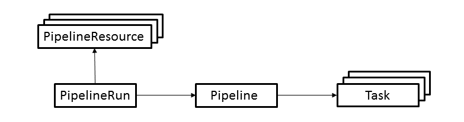

## Knative Deployment using Tekton Pipelines

Tekton is an open source project to configure and run CI/CD pipelines within a Kubernetes cluster.

## Objectives

In this tutorial you'll learn
* what are the basic concepts used by Tekton pipelines
* how to create a pipeline to build and deploy a Knative application
* how to run the pipeline, check its status and troubleshoot problems

## Prerequisites

* Create a standard Kubernetes cluster in IBM Kubernetes Service

* Create a private container registry in IBM Container Service

* Install Knative in your cluster

* Install Tekton in your cluster by following the instructions [here](https://cloud.google.com/tekton/)

## Tekton pipeline concepts

Tekton provides a set of extensions to Kubernetes, in the form of [Custom Resources](https://kubernetes.io/docs/concepts/extend-kubernetes/api-extension/custom-resources/) for defining pipelines.
The following diagram shows the resources used in this tutorial.  The arrows depict references from one resource to another resource.

The resources are used as follows.

* A **PipelineResource** represents an object that is an input (such as a git repository) or output (such as a docker image) of the pipeline.
* A **PipelineRun** ...
* A **Pipeline** ...
* A **Task** ...

